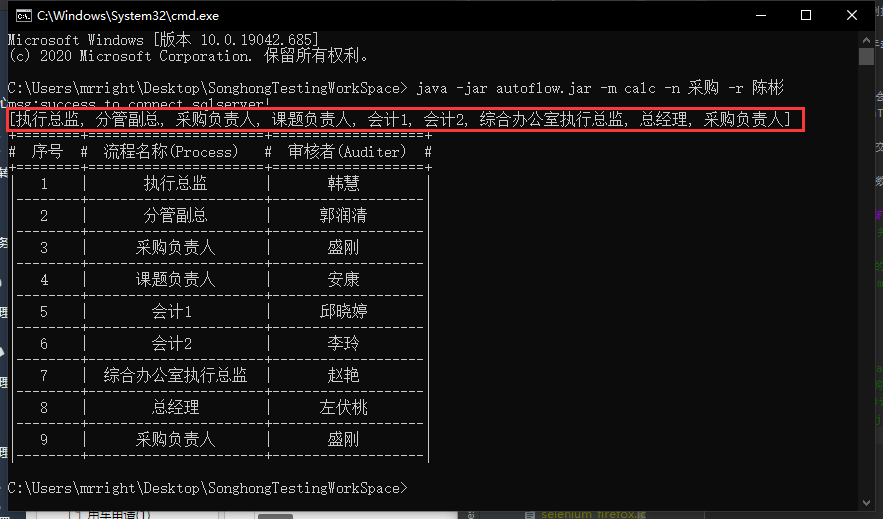
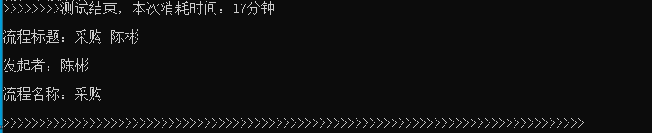
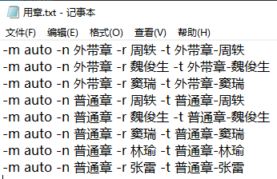
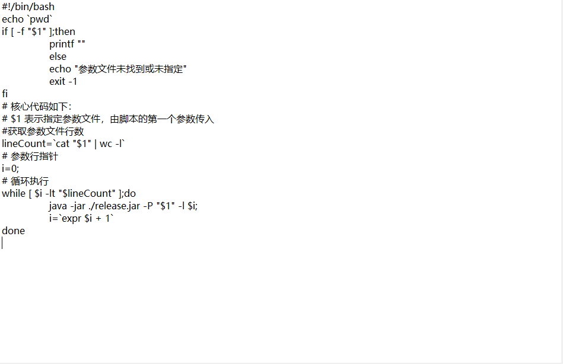

# SonghongAutomaticWorkFlow
# 淞泓智能汽车办公自动化系统流程测试工具

淞泓流程测试工具用于对淞泓系统的流程进行自动化测试，主要功能包含一下：
+ 流程计算： 通过发起人和流程名称计算出流程审核通过时需要经过的每一个审核者，并显示审核者列表。
+ 自动化流程审核：基于流程计算结果，自动登录每一个审核者的账号对指定流程标题的流程进行自动化审核，直到流程结束。
+ 手动流程：手动流程是指通过人工计算流程中每个节点的审核者，并将审核者序列输入后，对指定流程标题的流程进行自动化审核，直到流程审核结束
+ 流程驳回审核：若在执行自动化审核前指定流程--reject 选项并提供有效驳回间隔，则在流程中会根据指定间隔审核“不同意”值，直到流程审核结束

## 语义定义：

**流程申明**：在流程表中的flow字段包含的流程序列

**必过节点**：指无论如何都需要由指定人员审核的节点，节点所属岗位不分上下级关系，因此不参与流程基础逻辑，即流程申明中包含则最终流程生成后就一定存在；例如“申请人”，“会计”，“课题负责人”等
      
**非必过节点**：审核节点中岗位有明确等级的为“非必过节点”，(如总经理,分管副总,执行总监,部门总监 他们可以比较岗位大小)非必过节点会因为基于程序**基础逻辑**计算最终生成的流程序列中跳过不必要的审核节点；

**程序**: 下方提到的程序若无特别说明均指 **淞泓智能凄恻办公自动化系统流程测试工具**

**被测系统**: 被测系统指 **淞泓智能西侧办公自动化系统** 的正式环境或测试环境
## 程序中定义的流程基础逻辑：
1. **非必过节点** 中发起者不需要自己审核
2. **非必过节点** 中连续节点同一人审核时会跳过前面的节点并保留其中的最后一个节点
3. **非必过节点** 岗位的上级发起流程不需要 **非必过节点** 岗位的下级审核
4. **非必过节点** 的某个岗位下有多个人时，其中一人发起流程需要其他人审核

## 测试环境配置：
1. 数据库： 安装sqlserver或mysql,mysql需要8以上；
2. 下载安装火狐浏览器
3. 下载geckroDriver并将其加到环境变量path变量中。macOS或Linux参考下面的命令配置;对chrome未进行专门调试所以支持不是特别好，建议使用firefox浏览器作为测试浏览器
   
    `cd 包含geckroDriver的目录`
    
    `sudo echo '# Firefox 驱动' >> /etc/profile `
    
    `sudo echo 'export GECKRO_DRIVER'=` \`pwd\` `>> /etc/profile`
  
    `sudo echo 'export PATH=${GECKRO_DRIVER}:${PATH}' >> /etc/profile`
      
   `source /etc/profile`
   
4. 同时需要将浏览器的可执行文件所在目录加到环境变量path中（如firefox.exe所在目录），并在控制台输入`firefox`查看浏览器是否成功打开，若未成功检查环境变量；
5. 安装jre或jdk: 在oracle官网下载jre或jdk并安装，并在控制台或终端输入`java`，若有大量文字输出，则表示安装成功；若出现例如“未找到”或“not found”则说明未成功安装；检查环境变量是否正确配置。
## 程序配置文件：
    
   &#160; &#160; &#160; &#160;首次运行程序时（可通过`java -jar 程序包`运行指定jar包）程序会在当前目录创建properties/properties.txt文件；该文件即程序运行时配置文件;
   首次使用配置文件时，需阅读理解配置文件中的注释行意义，完全理解后可将其中的‘#’开始的注释行删除，以方便配置。 
   若配置文件错误或损坏时可直接删除properties目录并重新执行程序即可生成新的配置文件
## 数据库：
库名：mrright_songhongoa

数据表：flow

   |列名|数据类型|描述|
   |:----:|:----:|:----|
   |name|nvarchar(20) primary key|流程名称，通过流程名称访问流程申明序列|
   |flow| nvarchar(300)|流程申明序列|
   
数据表：staff

   |列名|数据类型|描述|
   |:----:|:-----:|:------|
   |account|varchar(20)|用于账户|
   |name|varchar(20)|职员真实姓名|
   |level|int|岗位级别，**非必过节点** 中通过发起人level大小和流程声明后初步获取的流程列表的每一个节点比较，若该值比节点中人员的值大，则跳过该人员审核|
   |post|varchar(20)|岗位|
   |department|varchar(20)|部门|
## 流程申明：
  &#160; &#160; &#160; &#160;流程申明即向数据库flow表中插入一条数据，名称根据需要自由命名即可,程序中通过名称取对应流程；取流程时匹配名称前缀，若匹配多个，则取第一个；
  流程申明序列使用“，”（**全角逗号**）进行分割，例如下面的示例流程声明：
  
  `执行总监，分管副总，综合办公室执行总监，综合办公室分管副总，总经理`

   &#160; &#160; &#160; &#160;上面的流程中每个节点包含两段定义：前半段为部门，后半段为职位；例如“综合办公室分管副总”，它表示该节点需要`department='综合办公室' and post='分管副总'`（语义化sql条件）来审核；若节点申明中不包含部门时则参考发起者所在部门；例如“分管副总”节点表示该节点需要`department=“流程发起者所在部门” and post = '分管副总'`（语义化sqL条件）来审核；如果结果包含多个人，则流程计算结果将显示多个同部门的人顺序审核
  
  【注意】：分上下级的职位并非可以任意定义名称，目前系统仅识别部门总监，执行总监和分管副总，其大小关系为：部门总监 < 执行总监 < 分管副总；在添加流程申明和员工信息时，都需要使用这些关键字作为岗位,流程才会与发起人进行非必过节点的计算；否则除这些词的岗位以外，都会被程序认为是**必过节点**
  
  【建议】：为了确保流程脚本文件中始终为最新流程，请不要直接对数据表做更新操作，应当首先保持更新sql脚本文件为最新，再删除原始库或表后使用脚本重新创建。
  
  当前最新流程会更新到项目sqls文件夹中的.sql文件中；可直接使用。
  
## 工具使用：
  该工具由java编写，基于selenium web自动化测试框架实现；通过命令行参数的方式执行；
  
  在配置文件中配置数据库和被测系统的登录页地址(淞虹测试环境或正式环境)后，开始使用。
  
  执行格式为： `java -jar “程序包.jar” [参数列表...]`;
  
  在命令行输入 `java -jar “程序包.jar” -h ''` 查看帮助信息
  
  **【注意】**: 因为main函数入口的参数仅支持键值对，所以参数列表最后单独的一个值将会被忽略，如果只传入-h程序是无法接收到该参数的，所以单个参数可以在后面任意添加字符将其传入。
  
  使用-h可以列出程序的可用选项，也可以不传入任何参数通过程序提示传入必要的参数；
  
  【注意】：参数区分大小写
### 模式：
  
    模式通过-m指定程序运行模式，根据不同的模式程序会执行不同的行为!
      
#### calc 计算流程：
通过-m选项指定calc后，并提供-r选项指定发起人，-n选项指定流程名称后，计算出需审核序列：
    
例如控制台输入下列语句的输出结果：
    
`java -jar release.jar -m calc -n 业务 -r 陈彬`

|序号|流程名称（Process）|审核者（Auditer）|
|:----:|:----:|:----:|
|1|执行总监|韩慧|
|2|分管副总|郭润清|
|3|综合办公室分管副总|赵艳|
|4|总经理|左伏桃|

【警告】： **若输出内容开头包含“未找到任何行！”时，本次计算结果不可信，需根据输出的sql语句检查数据库中人员和流程信息。**
#### auto 自动执行审核：
&#160; &#160; &#160; &#160;通过-m选项指定auto，并提供-r选项指定发起人，
-n选项指定流程名称，-t选项指定流程标题后；程序首先会根据发起人和流程标题计算出
流程审核者列表；再将流程审核者列表和流程标题交给自动审核模块；自动审核模块会按照流程审核者列表的顺序开始登录各自的账号完成审核操作;
    审核完毕后需检查被测流程是否已审核通过。
    流程执行时会打开浏览器并模拟人类操作进行流程审核
    若流程审核过程中因任何问题导致预期审核者的流程列表中并未出现指定标题的流程时，则程序会提示并暂停；
此时需确认被测系统的指定流程是否与预期不符，若被测系统OK，则需检查程序的流程申明；
处理完毕后需要继续审核下一节点则输入“done”，若想终止则输入“quit”退出程序。

&#160; &#160; &#160; &#160;若执行程序时指定了-R 选项则表示执行驳回测试，该选项用于指定驳回间隔数(指间隔指定个数审核者会执行一次驳回操作)；在实际流程审核者列表中第一位是发起人（下标0），流程始终是从下标1开始顺序审核；而如果指定驳回测试，并包含有效的驳回间隔（-1 < interval < 审核者列表长度)时流程审核时会包含“不同意”的审核，否则流程节点均审核为“同意”；当流程审核“不同意”时， 程序会立即登录审核者列表中下标为0（发起者）的用户账户进行重新提交操作，操作完成后，将流程审核者指针置为0，此时流程会重新回到第一个审核者开始审核；若驳回间隔设置为0，则表示没有间隔，每个节点都会执行一次驳回。

    驳回测试是非常耗时间的，例如1个12个审核节点的流程驳回时将间隔设为0后，则该流程将审核至少(流程节点数12个*驳回次数12次)/2=72次；12个节点的流程在目前系统中算中等长度的流程

&#160; &#160; &#160; &#160;在自动化执行时应尽量避免手动辅助点击，这样可能会误导程序判断页面状态，因为程序中每一步操作都需要判定是否成功，这通过判定周边的其他html元素的各种属性值来实现,如果未成功则会反复尝试直到成功;所以大多数情况下必须等待程序暂停后才可手动审核，避免错误发生；但有写操作并不需要一直等到程序暂停后才继续操作，这些操作通常会有专门的配置项来配置时长(尝试次数)，并且通常时间足够特定的操作，例如有的流程节点审核节点中需要填写表单的操作，此时程序在提交后会进行验证时间，并不会继续执行其他操作，一直等待验证完成或用尽尝试次数；测试人员可以在用尽尝试次数之前填写完成并提交审核后,程序校验流程提交已完成则会继续下一步操作而无需手动完成当前节点的剩余操作，当程序执行以下两种操作时，测试人员可在尝试次数范围内辅助操作：
1. 执行登录操作未果： 

&#160; &#160; &#160; &#160;当程序点击登录按钮后会并未进入加载页面(因某种原因仍然停留在登录页)时，程序会在规定的尝试次数内，每秒尝试一次确认被测系统登录成功；直到被测系统进入首页或因用尽尝试次数而暂停等待；在此时间内，若测试人员提前知道问题原因并手动登入系统后；程序将会检测登录成功并继续执行后续的操作，否则若未在尝试次数内完成则需要手动完成该节点的审核后再输入“done”继续；

通过配置文件中loginTryingCount设置最大尝试次数，弱网可增加值而防止频繁手动干预。

2. 检查是否审核通过时： 

&#160; &#160; &#160; &#160;当程序在审核页面中提交审核结果后，
程序会检查审核是否完成（审核完成后页面会关闭，class=“active”所属的元素id不为当前tab页的id）,
该判定用于确保当前节点审核完毕，防止因网络原因导致流程未审核完毕；
除了网络原因以外，若当前节点的审核者需要填写表单内容时，程序也会在指定尝试次数后暂停，
测试人员在尝试次数内完成表单审核可以不需要输入done，即可继续;
       
检查是否审核通过的次数可以通过配置文件中的tryingCount来设置尝试次数。
    
#### manual 通过流程序列审核：
    通过-m 选项指定manual，并提供-t 选项指定流程标题，-s选项指定流程队列后，程序会直接根据提供的审核者姓名列表完成流程审核操作；与参数-m auto 唯一的不同是它执行的流程审核者列表完全是由测试人员提供的，并不会进行任何计算；使用该选项可以测试一些不遵守基础逻辑或无法通过发起人计算的流程。-s字段提供序列通过，（全角逗号）分割，第一位为发起者。
    
    manual 同样可以执行流程的驳回测试。
    manual 遭遇断点时与以”-m auto“执行程序时处理方式相同。

## 示例流程测试：
+ 流程名称：采购申请
+ 发起者：陈彬
+ 程序名称：autoflow.jar
+ 计划使用的流程标题：采购-陈彬
1. 使用陈彬账户发起采购申请流程，并将流程标题设置为“采购-陈彬”；提交。
2. 【可选】在命令行输入`java -jar autoflow.jar -m calc -n 采购 -r 陈彬` 查看计算结果列表，对比被测系统生成的流程列表是否一致,
   若不一致则首先应该查看当前使用的流程列表是否符合预期，以及顶部是否包含"sql语句未找到任何行！"的提示，根据所示sql修复问题即可；若确认是被测系统问题，则不需要走下面的流程。

3. 在命令行输入 `java -jar autoflow.jar -m auto -n 采购 -r 陈彬 -t 采购-陈彬` 后开始执行流程自动。若无任何问题程序会审核完成并显示消耗时间,此时需检查流程状态确认流程是否已结束；
4. 采购申请-陈彬发起测试通过；且输出以下信息：(程序执行的速度完全取决于网络状态)

## 高级用法：
&#160; &#160; &#160; &#160;在流程中可以使用-p选项指定参数文件作为程序运行时的参数，通过该方式执行时，不再需要每次执行程序都将参数一起传递在命令行的最后，通过将参数放在参数文件中也可以记录测试case方便下次测试；
在使用参数文件时可以指定-l 来指定参数行(从0开始),默认为0,表示取第1行作为参数。下面为示例用章申请流程的参数文件：

### 将程序集成到其他工具中执行:
通过其他程序也可以调用测试工具来进行测试，例如java的Runtime.exec(String cmd)方法，或者通过脚本进行封装,但一切都是为了提高操作速度；例如可以批量创建流程后执行预定义的参数列表;
通过在自动义脚本中遍历行来调用，-r选项传入每行的index来实现遍历参数列表, 下面为bash脚本的实现的核心代码，测试人员可根据自己的喜好自由选择脚本实现：

【注意】: 使用参数文件时，需要保证参数文件的编码格式与当前系统的编码格式对应，例如默认Windows系统格式为GBK，使用记事本编辑参数文件时需保存为ANSI；其他默认编码格式为UTF-8的系统则需要保存为UTF-8；

除此之外甚至可以很容易的为工具封装GUI图形操作界面